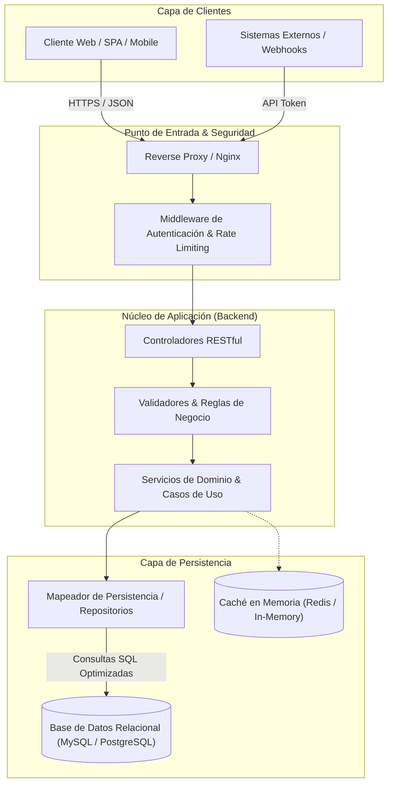

# [Nombre del Proyecto / Sistema]

<div align="center">

[](https://github.com/copito111)
[](https://github.com/copito111)
[](https://github.com/copito111)
[](LICENSE)
[](https://github.com/copito111)

<p align="center">
  <b>[Descripción corta y de alto impacto del sistema: Ej. Motor transaccional de alto desempeño para gestión de flujos de pago distribuidos.]</b>
</p>

[ 📖 Descripción General ](#-resumen-ejecutivo) • [ 🏛️ Arquitectura ](#️-arquitectura-y-flujo-de-datos) • [ ⚡ Inicio Rápido ](#-inicio-rápido-en-3-pasos) • [ ⚙️ Variables de Entorno ](#️-especificación-de-variables-de-entorno) • [ 🤝 Contribución ](#-guía-de-contribución)

</div>

---

## 📖 Resumen Ejecutivo

### El Problema
[Describe en 2-3 párrafos el dolor técnico o de negocio que resuelve este proyecto. Evita descripciones genéricas. Ej: En entornos de alta concurrencia, las operaciones de inventario sufren de inconsistencias de lectura sucia y contención en bloqueos de base de datos...]

### La Solución
[Explica cómo la arquitectura y el stack tecnológico resuelven dicho problema de forma elegante, escalable y mantenible...]

### Características Principales
- **Desempeño & Baja Latencia:** Optimizado para transacciones críticas con validación en memoria y consultas SQL indexadas.
- **Modelado Inmutable:** Dominio estructurado con inmutabilidad estricta y reducción total de estados mutables accidentales.
- **Tolerancia a Fallos:** Manejo defensivo de excepciones, circuit breakers y recuperación determinista.
- **Seguridad por Diseño:** Autenticación robusta, saneamiento estricto de entradas y protección contra inyecciones SQL.

---

## 🏛️ Arquitectura y Flujo de Datos

El sistema implementa una arquitectura en capas desacopladas con segregación de responsabilidades:



---

## ⚡ Inicio Rápido en 3 Pasos

### Requisitos Previos
- **Runtime:** [Especificar versión: Ej. Java JDK 21 LTS / Node.js 20 LTS / Python 3.11+]
- **Base de Datos:** [Especificar motor: Ej. MySQL 8.0+ / PostgreSQL 15+]
- **Herramienta de Construcción:** [Especificar: Ej. Maven / Gradle / npm / pip]

### 1. Clonar el Repositorio
```bash
git clone https://github.com/copito111/[nombre-repositorio].git
cd [nombre-repositorio]
```

### 2. Configurar el Entorno
Copia la plantilla de entorno y define tus credenciales locales:
```bash
cp .env.example .env
# Edita las variables de conexión a la base de datos en .env
```

### 3. Compilar y Ejecutar
```bash
# Paso de construcción de artefacto
[comando-de-construccion: ej. ./mvnw clean install | npm install | composer install]

# Ejecución en modo desarrollo / producción
[comando-de-arranque: ej. java -jar target/app.jar | npm start | php artisan serve]
```

El servicio estará disponible en: `http://localhost:8080/api/v1/health`

---

## ⚙️ Especificación de Variables de Entorno

Asegúrate de configurar los siguientes parámetros en tu archivo `.env` antes del despliegue:

| Variable | Tipo | Requerida | Valor por Defecto | Descripción |
| :--- | :--- | :--- | :--- | :--- |
| `APP_ENV` | String | Sí | `production` | Entorno de ejecución (`development`, `staging`, `production`). |
| `APP_PORT` | Integer | No | `8080` | Puerto TCP en el que escucha el servidor HTTP. |
| `DB_HOST` | String | Sí | `127.0.0.1` | Dirección de red del servidor de base de datos. |
| `DB_PORT` | Integer | Sí | `3306` | Puerto de conexión a la base de datos (ej. 3306 para MySQL). |
| `DB_DATABASE` | String | Sí | `app_production` | Nombre de la base de datos relacional. |
| `DB_USERNAME` | String | Sí | - | Usuario con privilegios de lectura/escritura. |
| `DB_PASSWORD` | String | Sí | - | Contraseña de autenticación de base de datos. |
| `JWT_SECRET` | String | Sí | - | Clave criptográfica para firma de tokens de sesión. |

---

## 🧪 Pruebas y Aseguramiento de Calidad

Para ejecutar la suite automatizada de pruebas unitarias y de integración:

```bash
# Ejecutar todas las pruebas unitarias
[comando-test: ej. ./mvnw test | npm test | php artisan test]

# Generar reporte de cobertura de código
[comando-coverage: ej. ./mvnw jacoco:report | npm run test:coverage]
```

---

## 🤝 Guía de Contribución

Las contribuciones siguen el estándar de ramas de Git Flow:

1. Realiza un Fork del proyecto.
2. Crea una rama para tu feature (`git checkout -b feature/mejora-arquitectura`).
3. Realiza commits convencionales siguiendo [Conventional Commits](https://www.conventionalcommits.org/):
   ```bash
   git commit -m "feat(auth): implement token refresh rotation mechanism"
   ```
4. Envía tus cambios a tu repositorio remoto (`git push origin feature/mejora-arquitectura`).
5. Abre un **Pull Request** formal detallando los cambios y casos de prueba ejecutados.

---

## 📄 Licencia

Este proyecto está bajo la Licencia **MIT**. Consulta el archivo [LICENSE](LICENSE) para más detalles.

---

<div align="center">
  <sub>Desarrollado y mantenido por <b>Camilo Andrés Tamayo Durán</b> (<a href="https://github.com/copito111">@copito111</a>)</sub><br/>
  <sub>Staff Backend Software Engineer • Neiva, Colombia</sub>
</div>
