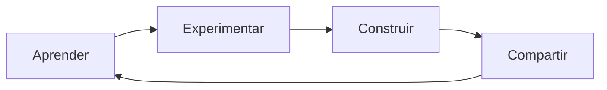

<!--
  README DE PERFIL PARA GITHUB
  Para usarlo: crea un repositorio con el mismo nombre de tu usuario de GitHub
  y sube este archivo renombrado como README.md.
-->

<div align="center">

# ⚡ CAMILO ANDRÉS TAMAYO

### `SOFTWARE • INTELIGENCIA ARTIFICIAL • DATOS`


**`CONSTRUIR  →  PROBAR  →  APRENDER  →  MEJORAR`**

[](https://portfolio-ly-minh.perryhowardveohtnzxp.chatgpt.site)

</div>

---

## ◈ SOBRE MÍ

```text
NOMBRE      Camilo Andrés Tamayo
UBICACIÓN   Neiva, Huila — Colombia
FORMACIÓN   Tecnólogo en Análisis y Desarrollo de Software · SENA
ENFOQUE     Desarrollo web · Bases de datos · Linux · Inteligencia artificial
FILOSOFÍA   Aprender haciendo proyectos reales
```

Soy desarrollador en formación y disfruto convertir preguntas técnicas en
proyectos que funcionan. Me interesa comprender el **porqué** detrás de cada
solución, experimentar directamente y analizar los errores hasta encontrar su
causa.

> La IA no es solamente una herramienta para responder preguntas: es un socio
> para aprender, construir y ejecutar ideas.

---

## ✦ PROYECTO DESTACADO — TITAN IA

<div align="center">


</div>

**TITAN IA** es mi laboratorio de aprendizaje y emprendimiento. Su objetivo es
convertir la inteligencia artificial, la automatización y la creación de
contenido en productos y servicios útiles.



**Áreas que exploro:**

- Modelos locales con Ollama, Mistral y Gemma.
- Automatización de tareas y procesos.
- Desarrollo de productos y servicios con IA.
- Creación de contenido, marketing y comunicación.
- Inglés, persuasión y habilidades para emprender.

---

## ⬡ PROYECTOS Y LABORATORIOS

| PROYECTO | ENFOQUE | TECNOLOGÍAS / CONCEPTOS |
|:--|:--|:--|
| **TITAN IA** | Emprendimiento y experimentación con IA | IA local · Automatización · Producto |
| **CAFÉ WEB** | Operación digital para un café | PHP · MySQL · Panel administrativo |
| **SQL LAB** | Diseño relacional y 60 ejercicios prácticos | MySQL · DBeaver · Modelo E–R |
| **LINUX WORKBENCH** | Configuración, diagnóstico y aprendizaje | Ubuntu · Debian · Arch · Hardware |

---

## ⚙ STACK TECNOLÓGICO

### DESARROLLO WEB


### DATOS Y LÓGICA


### SISTEMAS Y HERRAMIENTAS


### INTELIGENCIA ARTIFICIAL


---

## ⌁ ASÍ APRENDO

```bash
$ camilo --modo-aprendizaje

✓ Entender el problema antes de elegir la herramienta
✓ Seguir una ruta clara y práctica
✓ Construir un proyecto mientras aprendo
✓ Analizar cada error, no esconderlo
✓ Mejorar la experiencia, no solamente hacer que funcione

> estado: curiosidad activa
```

---

## ◎ RUMBO ACTUAL

- [x] Fortalecer lógica de programación y bases de datos.
- [x] Construir interfaces web intuitivas y profesionales.
- [x] Configurar entornos Linux y modelos locales de IA.
- [ ] Convertir TITAN IA en productos y servicios reales.
- [ ] Profundizar en automatización, marketing e inglés.
- [ ] Colaborar en proyectos donde pueda aprender y aportar.

---

<div align="center">

### ¿CONSTRUIMOS ALGO REAL?

Estoy abierto a proyectos de aprendizaje, desarrollo web, datos e inteligencia
artificial donde una idea pueda convertirse en una solución útil.


`Gracias por visitar mi perfil — siempre hay algo nuevo por aprender.`

</div>
